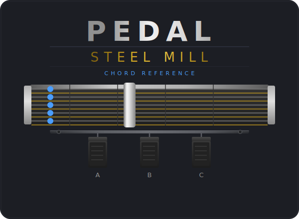
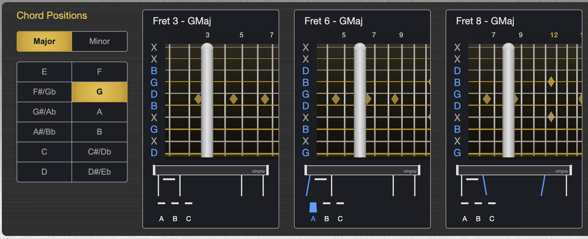
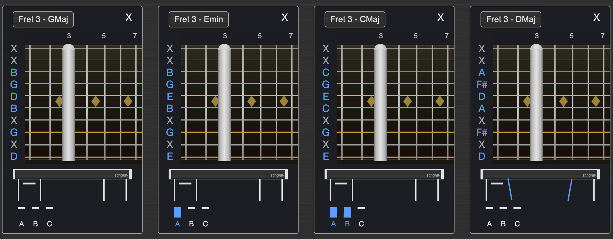

*An interactive chord reference and chart tool for the pedal steel guitar*

**[Try it live →](https://bschwinn.github.io/pedalsteelmill/)**

---

## What is this?

Pedalsteelmill is a web app for learning chords on the [pedal steel guitar](https://en.wikipedia.org/wiki/Pedal_steel_guitar) — specifically the classic [E9 tuning](https://en.wikipedia.org/wiki/E9_tuning) on a 10-string, 3-pedal, 5-knee-lever setup.

It was built by a six-string guitarist who bought a pedal steel and immediately ran into a very specific problem: *the fretboard logic is completely different*. On a standard guitar you can intuit where the next chord is. On a pedal steel, the same chord appears at multiple positions up and down the neck, and figuring out which ones are close together takes real study. This app makes that visual and interactive.

**Two questions it helps answer:**
- When I'm playing a 7th-fret E major, where's the closest A major? The closest F# minor?
- How can I play through a chord progression without moving the bar all over the place?

---

## The instrument

A pedal steel guitar is a lap steel guitar with a set of pedals and knee levers that change the pitch of individual strings. The [E9 copedent](https://en.wikipedia.org/wiki/Copedent) is the standard country tuning and is where most beginners start. Unlike a standard guitar, the strings are not tuned in fourths — the open strings form a chord, and chords are played by pressing a bar across the strings at different frets, with pedals and levers modifying individual string pitches.

This makes chord position work fundamentally different from standard guitar, and a visual reference is genuinely useful.

---

## Features

### Chord Positions

Browse every fret position of any major or minor chord on the E9 neck. Select a root note and tonality (major/minor) and see all positions displayed side by side — fret numbers, string markers, pedal/lever combinations, and all.



### Chord Chart

Build a chord progression chart by adding chord positions to a list. The chart is fully editable:
- Drag and drop to reorder chords
- Change a chord's root, tonality, or fret position inline
- Drag the note selector to pick a specific fret position
- Use it as a quick visual reference while practicing



---

## Getting started

This is a [React](https://react.dev/) + [TypeScript](https://www.typescriptlang.org/) app built with [Vite](https://vite.dev/).

```bash
npm install
npm run dev
```

Then open `http://localhost:5173` in your browser.

```bash
npm run build    # production build
npm run preview  # preview the production build locally
```

---

## Roadmap

- Support for 7th chords
- C6 tuning / additional [copedents](https://en.wikipedia.org/wiki/Copedent)
- User-customizable tuning configurations

---

## About

Built by [Stingray Engineering](https://github.com/bschwinn) — a six-string player doing his best on a new 10-string E9.
